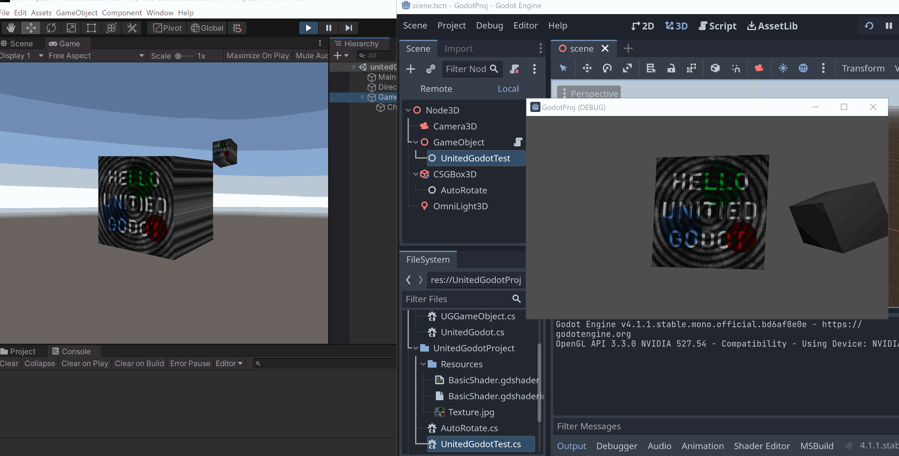

# United Godot - Cross Engine Development

### ! EXPERIMENTAL !

This is a small experiment / POC, aimed at C# and Shader
dev, which can be built with both Unity and Godot.

The repo contains a Godot project.
The folder [UnitedGodotProject](UnitedGodotProject) contains **Unity-compatible scripts**:

 - [AutoRotate.cs](UnitedGodotProject/AutoRotate.cs) - very simple
 - [UnitedGodotTest.cs](UnitedGodotProject/UnitedGodotTest.cs) - More advanced...

To try in Unity, copy `UnitedGodot` / `UnitedGodotProject` folders into Assets,
and attach [UnitedGodotTest.cs](UnitedGodotProject/UnitedGodotTest.cs) to a GameObject...

## Background

 * Relying on Unity is becoming increasingly untenable
 * I mostly need Unity for cross-platform/hardware support
 * I generally don't use fancy features or heavy editor integration
 * It's probably faster to port a small subset of Unity to Godot, than to port all my code...

## Mapped functionality

Classes / structs and their Godot mapping, see details in the [source](UnitedGodot/UnitedGodot.cs)

    MonoBehaviour  - inherits from Godot.Node
    GameObject     - has a reference to a Godot.Node3D or UnitedGodot.UGGameObject
    Mesh           - creates/owns a Godot.ArrayMesh
    MeshFilter     - has a (nullable) reference to a Mesh
    MeshRenderer   - creates/owns a Godot.MeshInstance3D
    Vector3        - owns Godot.Vector3 (same for vec2/vec4/color)
    Resources.Load - calls Godot.GD.Load
    Material       - Godot.ShaderMaterial
    Shader         - Godot.Shader
    Texture2D      - Godot.Texture2D

### Shader

The basic shader set-up is [using](UnitedGodotProject/Resources/BasicShader.shader) [three](UnitedGodotProject/Resources/BasicShader.gdshader) [files](UnitedGodotProject/Resources/BasicShader.gdshaderinc) per shader

    .shader      - Unity template (+config of culling/blending etc)
    .gdshader    - Godot template (+config of culling/blending etc)
    .gdshaderinc - The main (shared) shader code

## Goals

 * Investigate if this is a useful way to reduce Unity dependency
 * Learn a bit about Godot

## Non-Goals

 * Making a complete Unity API adapter
 * Making even a semi-complete Unity API adapter

## Problems & Misc Chaotic Notes

 * For Unity-style scripts to work, they need to use `partial` class
 * Only the functionality inside UnitedGodotTest.cs was tested, and not much more was implemented
 * I don't know why I have to flip the uv coords on Godot
 * There's probably unnecessary overhead using the Godot spatial pbr shading system to render plain unlit stuff (at least the fog seems to always on), but I did not find any alternative
 * The mapped abstraction don't do anything about the handedness difference (currently handled manually in the UnitedGodotTest.cs), is there a good way to do this?
 * Only single kind of textures supported (jpg currently), would be easy to add a function `UnitedGodot.Load()` which supports extension, or use loop through image types and check if available.  
 * No mapping of delete/destruction was done
 * Mappings of Vector/Color structs means Godot inspection UI don't work for these types, anyone know a way to solve this?
 * Mappings of Vector/Color structs means arrays have to be copied, not really acceptable for larger data!
 * In Unity, if textures are added to the *.gdshaderinc file, they also need to be added to the Properties section of the .shader file in order to work
 * Godot don't yet support building C# projects for Mobile etc
 * Godot C# support for new projects: You have to manually click Menu->Tools->C#->Create C# Solution
 * Godot Editor: Scenes easily break if you move around or rename folder/files 
 * Godot C#: Reloading of source code feels shaky, unload assemblies sometimes fails and script properties are set to zero (even though this is not even the default)
 * Godot Editor: gdshaderinc files often don't refesh properly, and when exiting the editor, any changes (edited in external editor) are erased as an older version is written to disk
